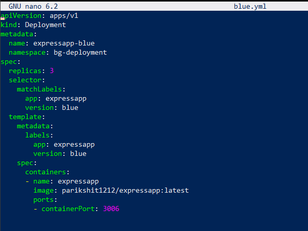
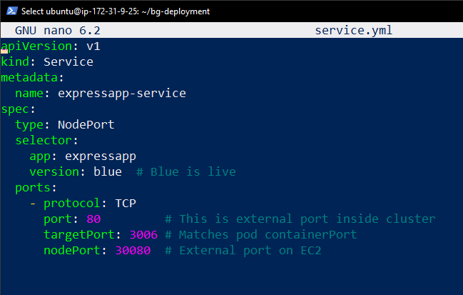
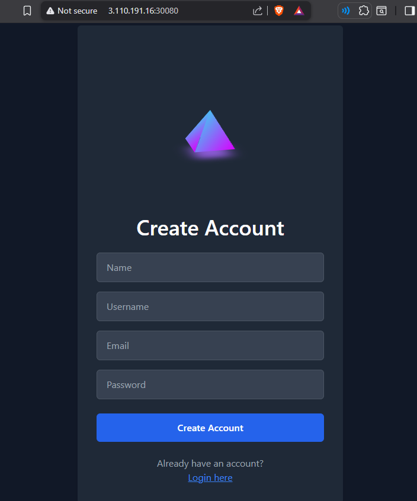
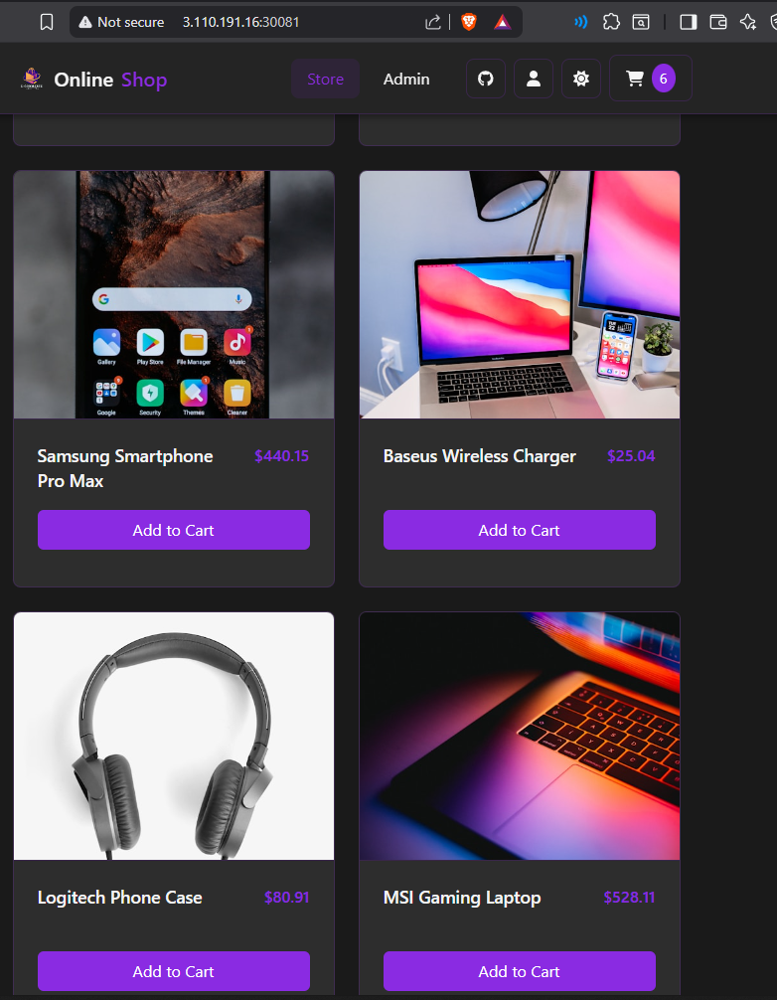
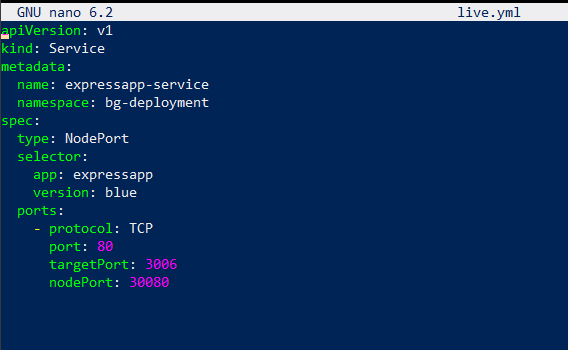
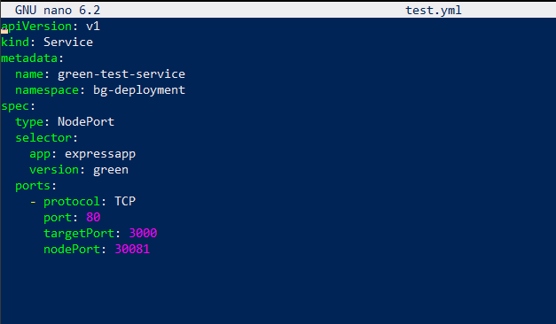

# 🚀 Blue-Green Deployment.

---


https://github.com/user-attachments/assets/c17cb2d4-c959-4167-9f49-ce0dc60a770c


---

## 📝 Short Report

### 1. Steps Taken to Set Up Blue-Green Deployment

- **Set up Minikube Cluster**
  - Installed and started Minikube for local Kubernetes testing.  

- **Created Deployments:**
  - **Blue Deployment** → current stable version (previous project image).  
      

  - **Green Deployment** → new/updated version (open-source random image).  
      

- **Exposed Services:**
  - Created **live.yml** for production traffic.  
  - Created **test.yml** for testing updated version.  
      

- **Validated Access in Browser:**
  - Blue App running and accessible.  
      
  - Green App running and accessible.  
      

- **Live & Test Views:**
  - Current Live App  
      
  - Test App  
      

---

### 2. Switching Traffic (Blue ➝ Green)

- Updated the `live.yml` Service selector from:  
  ```yaml
  version: blue
  targetPort: 3000
--- 

**Result:**  
Traffic shifted to **Green version** instantly without downtime.  

---

### 3. Rollback Strategy

If any issue occurs with Green version:  
- Update Service selector back to **Blue**.  
- Apply again → traffic instantly shifts back.  

✅ Achieved rollback with **zero downtime**.  

---

### 4. Tools and Kubernetes Components Used

- **Minikube** → Local Kubernetes cluster setup  
- **Deployments** → Separate Blue & Green versions  
- **Services (NodePort)** → To expose both versions on browser  
- **YAML Manifests** → Defined deployments & services (`blue.yml`, `green.yml`, `live.yml`, `test.yml`)  
- **kubectl** → Applied changes, switched traffic, and validated rollout  

---


  

